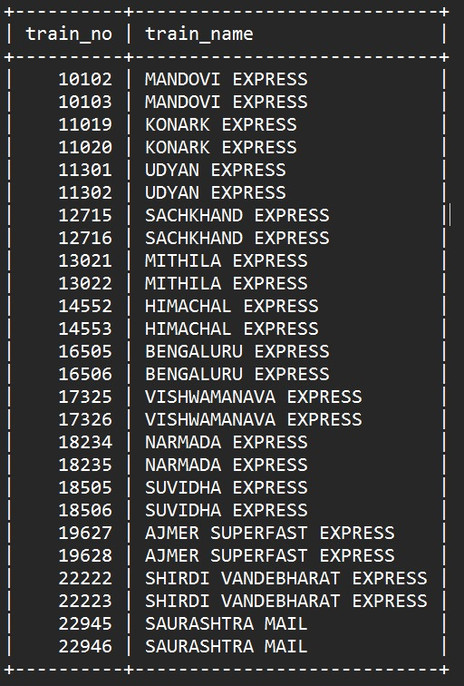
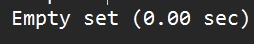
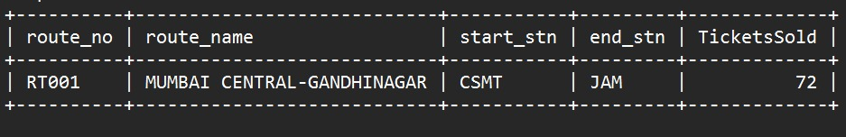
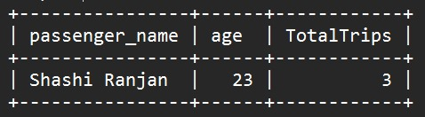
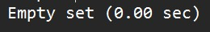

# Set - C

### 1.List all trains not scheduled on 10th October this year.
```sql
 Select train_no, train_name
    -> FROM trains
    ->  WHERE route_no NOT IN (
    ->  SELECT DISTINCT t.Route_no
    ->  FROM train_schedule t
    ->  WHERE t.Date = '2023-10-10'
    ->  );
```
## OUTPUT


<hr>

### 2.List all fleets from Dharwad to Bengaluru, in ascending order of their monthly seats sold for the month of October this year.
```sql
SELECT
    ->     T.Train_no,
    ->     T.Train_name,
    ->     COUNT(Ti.Ticket_no) AS SeatsSold
    -> FROM
    ->     Trains T
    -> JOIN
    ->     Train_schedule TS ON T.Train_no = TS.Train_no
    -> JOIN
    ->     Routes R ON TS.Route_no = R.Route_no
    -> JOIN
    ->     ticket_coach_mapping TCM ON T.Train_no = TCM.train_no
    -> JOIN
    ->     Tickets Ti ON TCM.ticket_no = Ti.Ticket_no
    -> WHERE
    ->     R.Start_Stn = 'Dharwad' AND R.End_Stn = 'Bengaluru'
    ->     AND MONTH(Ti.date_of_journey) = 10
    ->     AND YEAR(Ti.date_of_journey) = YEAR(CURRENT_DATE())
    -> GROUP BY
    ->     T.Train_no, T.Train_name
    -> ORDER BY
    ->     SeatsSold ASC;
```
## OUTPUT


<hr>

### 3.List the details of most popular route of InterCity Express Trains.
```sql
SELECT
    ->     R.route_no,
    ->     R.route_name,
    ->     R.start_stn,
    ->     R.end_stn,
    ->     COUNT(Ti.ticket_no) AS TicketsSold
    -> FROM
    ->     Routes R
    -> JOIN
    ->     Train_schedule TS ON R.route_no = TS.route_no
    -> JOIN
    ->     Trains T ON TS.train_no = T.train_no
    -> JOIN
    ->     ticket_coach_mapping TCM ON T.train_no = TCM.train_no
    -> JOIN
    ->     Tickets Ti ON TCM.ticket_no = Ti.ticket_no
    -> GROUP BY
    ->     R.route_no, R.route_name, R.start_stn, R.end_stn
    -> ORDER BY
    ->     TicketsSold DESC
    -> LIMIT 1;
```
## OUTPUT


<hr>

### 4.Display the details of the passengers who are frequent travellers with InterCity Express Trains. [Frequent traveller can be defined as the one who has travelled at least three times, irrespective of the route.
```sql
SELECT
    ->     Ti.passenger_name,
    ->     Ti.age,
    ->     COUNT(DISTINCT Ti.ticket_no) AS TotalTrips
    -> FROM
    ->     Tickets Ti
    -> WHERE
    ->     Ti.passenger_name IS NOT NULL
    -> GROUP BY
    ->     Ti.passenger_name, Ti.age
    -> HAVING
    ->     TotalTrips >= 3
    -> ORDER BY
    ->     TotalTrips DESC;
```
## OUTPUT


<hr>

### 5.Display the details of trains which arrived late at their destination, more than once in this year; Include the driver and co-driver information in the output. 
```sql
SELECT
    ->     T.Train_no,
    ->     T.Train_name,
    ->     TS.station_code AS Destination,
    ->     TS.Date AS Arrival_Date,
    ->     TS.AAT AS Actual_Arrival_Time,
    ->     TS.ADT AS Actual_Departure_Time,
    ->     SS.staff_no AS Driver,
    ->     SS2.staff_no AS Co_Driver
    -> FROM
    ->     Train_schedule TS
    -> JOIN
    ->     Trains T ON TS.Train_no = T.Train_no
    -> JOIN
    ->     staff_schedule SS ON TS.Train_no = SS.train_no
    -> JOIN
    ->     staff_schedule SS2 ON TS.Train_no = SS2.train_no
    -> WHERE
    ->     TS.ADT > TS.EDT
    ->     AND YEAR(TS.Date) = YEAR(CURRENT_DATE()) 
    -> GROUP BY
    ->     T.Train_no, TS.station_code, TS.Date, TS.AAT, TS.ADT, SS.staff_no, SS2.staff_no
    -> HAVING
    ->     COUNT(*) > 1
    -> ORDER BY
    ->     T.Train_no, TS.station_code, TS.Date;

```
## OUTPUT


<hr>


