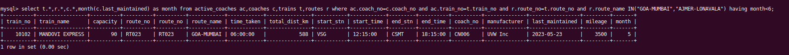

# Set - A

### 1.Show all trains information travelling between Goa Mumbai and Ajmer-Lonavala where at least half the coaches are due for maintenance on or before 30 November this year.
```sql
select t.*,r.*,c.*,month(c.last_maintained) as month from active_coaches ac,coaches c,trains t,routes r where ac.coach_no=c.coach_no and ac.train_no=t.train_no and r.route_no=t.route_no and r.route_name IN("GOA-MUMBAI","AJMER-LONAVALA") having month<6;
```
## OUTPUT


<hr>

### 2.List all the routes in descending order of seats sold, including route information and distribution of seats sold (Children, Adult, Senior Citizen) in the month of October this year.
```sql
select r.route_no,r.route_name,der.* from routes r,trains t,(select train_no,passenger_type,count(ticket_no) as count from tickets where month(booking_date)=10 group by train_no,passenger_type order by(count) desc) der where der.train_no=t.train_no and t.route_no=r.route_no;
```
## OUTPUT


<hr>

### 3.List all agents’ information with more than 10 confirmed bookings in the month of September this year.
```sql
select ta.*, dt.count from travel_agents ta,(select travel_agent_id,count(ticket_no) as count from tickets where travel_agent_id is not null and status="confirmed" group by travel_agent_id having count>10) dt where dt.travel_agent_id=ta.travel_agent_id;
```
## OUTPUT


<hr>

### 4.Display the details of the route most travelled by Senior Citizens.
```sql
select r.*,tt.* from routes r,trains t,(select t.train_no,max(t.count) from (select train_no,count(ticket_no) as count from tickets where passenger_type="senior citizen" group by train_no) t group by t.train_no) tt where tt.train_no=t.train_no and t.route_no=r.route_no;
```
## OUTPUT


<hr>

### 5.Display the details of the route where a train was always on time.
```sql
select r.*, ts.EAT,ts.AAT from routes r,train_schedule ts where ts.EAT=ts.AAT and ts.route_no=r.route_no;
```
## OUTPUT


<hr>
