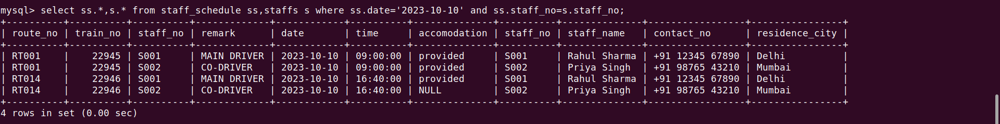
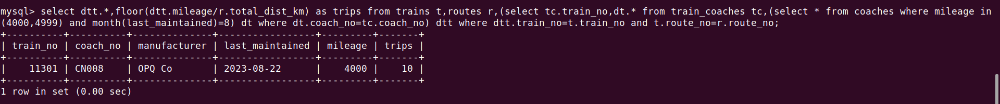
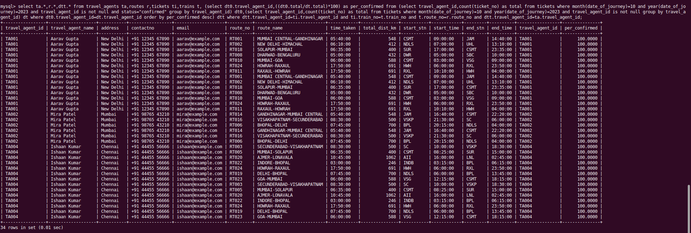
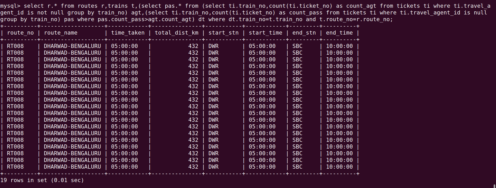
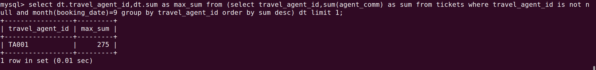

# Set - B

### 1.Show schedule of all trips including main driver information for 10th October this year.
```sql
select ss.*,s.* from staff_schedule ss,staffs s where ss.date='2023-10-10' and ss.staff_no=s.staff_no;
```
## OUTPUT


<hr>

### 2.List all coaches with mileage between 4000 and 4999 km covered for September this year; include information on the coach, its last service date and total number of scheduled trips.
```sql
select dtt.*,floor(dtt.mileage/r.total_dist_km) as trips from trains t,routes r,(select tc.train_no,dt.* from train_coaches tc,(select * from coaches where mileage in(4000,4999) and month(last_maintained)=8) dt where dt.coach_no=tc.coach_no) dtt where dtt.train_no=t.train_no and t.route_no=r.route_no;
```
## OUTPUT


<hr>

### 3.List all agents, in descending order of percentage of confirmed booking each trip in the month of October this year. Include agent and route information in your result.
```sql
select ta.*,r.*,dtt.* from travel_agents ta,routes r,tickets ti,trains t, (select dt0.travel_agent_id,((dt0.total/dt.total)*100) as per_confirmed from (select travel_agent_id,count(ticket_no) as total from tickets where month(date_of_journey)=10 and year(date_of_journey)=2023 and travel_agent_id is not null and status="confirmed" group by travel_agent_id) dt0,(select travel_agent_id,count(ticket_no) as total from tickets where month(date_of_journey)=10 and year(date_of_journey)=2023 and travel_agent_id is not null group by travel_agent_id) dt where dt0.travel_agent_id=dt.travel_agent_id order by per_confirmed desc) dtt where dtt.travel_agent_id=ti.travel_agent_id and ti.train_no=t.train_no and t.route_no=r.route_no and dtt.travel_agent_id=ta.travel_agent_id;
```
## OUTPUT


<hr>

### 4.Display the details of the routes where majority of bookings are not made by agents.
```sql
select r.* from routes r,trains t,(select pas.* from (select ti.train_no,count(ti.ticket_no) as count_agt from tickets ti where ti.travel_agent_id is not null group by train_no) agt,(select ti.train_no,count(ti.ticket_no) as count_pass from tickets ti where ti.travel_agent_id is null group by train_no) pas where pas.count_pass>agt.count_agt) dt where dt.train_no=t.train_no and t.route_no=r.route_no;
```
## OUTPUT


<hr>

### 5.Display the details of the agents who have made maximum commission in the Month of September.
```sql
select dt.travel_agent_id,dt.sum as max_sum from (select travel_agent_id,sum(agent_comm) as sum from tickets where travel_agent_id is not null and month(booking_date)=9 group by travel_agent_id order by sum desc) dt limit 1;
```
## OUTPUT


<hr>
